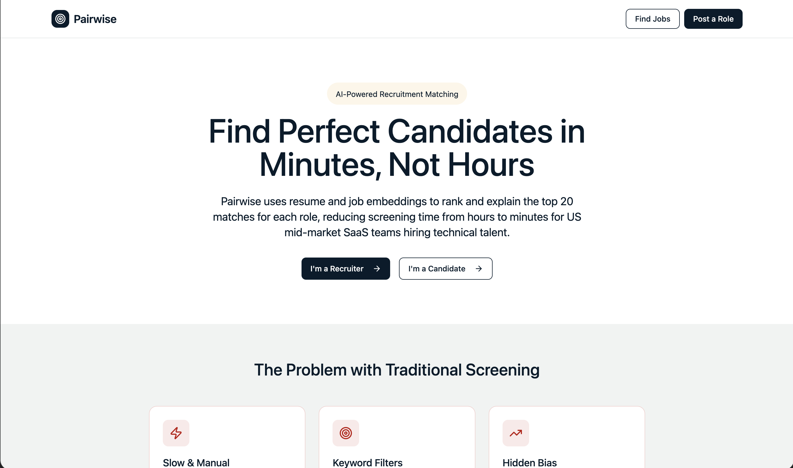

# Pairwise — AI-Powered Resume Matching Engine

Semantic resume-to-job matching using vector embeddings and LLM-generated fit evidence.
Built to replace slow keyword-based ATS filtering with real-time AI ranking for technical roles.

**Arizona State University — MS in AI/Business | Group Capstone Project, 2026**

---

## The Problem

Traditional ATS systems filter candidates by keyword overlap — a resume missing the exact phrase
"distributed systems" gets rejected even if the candidate built one. Pairwise uses semantic
vector similarity to match *meaning*, not keywords.

## What I Built

A full-stack AI matching application with a FastAPI backend and React frontend:

- **Semantic matching engine** — sentence-transformers (`all-MiniLM-L6-v2`) embed both resumes
  and job descriptions into the same vector space, then cosine similarity ranks candidates
- **LLM-generated fit evidence** — Groq (`llama-3.3-70b`) explains *why* each match scored
  the way it did, giving recruiters 3 specific evidence bullets per candidate
- **Bias mitigation layer** — demographic signals are excluded from the vector matching step
  before any score is computed; low-confidence matches are flagged for human review
- **ATS-ready JSON output** — match scores + fit evidence delivered as a typed Pydantic payload
  that integrates with Greenhouse, Lever, or Ashby without vendor customization
- **4-screen React UI** — Landing → Resume Upload → Job Requirements → Ranked Results dashboard

## Demo



## Architecture

pairwise-ai-matching/
├── backend/ Python 3.11 + FastAPI
│ └── app/
│ ├── api/routes.py POST /api/v1/match endpoint
│ ├── models/schemas.py Pydantic: MatchPayload, FitEvidence, ATSTag
│ └── services/
│ ├── embeddings.py sentence-transformers vector encoding
│ ├── groq_client.py Groq LLM for fit evidence generation
│ └── matcher.py Core: embed → cosine rank → LLM explain
└── frontend/ React 18 + Vite + Tailwind CSS v4
└── src/
├── App.tsx 4-screen application flow
├── lib/api.ts Typed API client
└── components/ shadcn/ui component library


## Tech Stack

| Layer | Technology |
|---|---|
| Backend API | Python 3.11, FastAPI, Pydantic |
| AI / LLM | Groq API (`llama-3.3-70b`) |
| Embeddings | `sentence-transformers` (`all-MiniLM-L6-v2`) |
| Frontend | React 18, Vite, Tailwind CSS v4, shadcn/ui |
| Infrastructure | Docker, Railway |

## Match Score Logic

| Score | ATS Tag | Action |
|---|---|---|
| 0.82+ | `strong_match` | Auto-advance to interview queue |
| 0.65–0.81 | `good_match` | Recruiter review recommended |
| 0.50–0.64 | `review` | Closer look needed |
| < 0.50 | `below_threshold` | Does not meet minimum bar |

## API

**`POST /api/v1/match`** — Send a job posting + resume array, receive ranked candidates with
match scores and fit evidence.

**`GET /api/v1/health`** — Service health check.

See [`backend/app/api/routes.py`](./backend/app/api/routes.py) for full request/response schemas.

## How to Run

### Prerequisites
- Python 3.11+
- Node.js 18+
- [Groq API key](https://console.groq.com/)

### Backend
```bash
cd backend
cp .env.example .env     # Add your GROQ_API_KEY
pip install -r requirements.txt
python run.py            # http://localhost:8000
```

### Frontend
```bash
cd frontend
npm install
npm run dev              # http://localhost:5173
```

## Key Design Decisions

- **Groq over OpenAI for fit evidence**: Groq's inference speed (~10x faster) made real-time
  per-candidate explanation practical without batching
- **sentence-transformers over OpenAI embeddings**: Runs locally, no API cost per resume,
  and `all-MiniLM-L6-v2` is well-benchmarked for short-text semantic similarity
- **Human-in-the-loop by default**: Scores below 0.50 never auto-tag — they always surface
  for manual review, keeping a human accountable for rejection decisions
